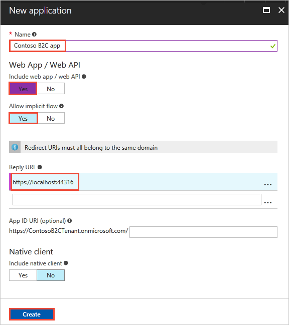

Flexibility is a key part of Azure Active Directory B2C. Use built-in policies to create a login experience in minutes. For more complex scenarios, use our identity experience framework to build custom policies.

<!--more-->

This article is one of the two part series I wrote on how to use Azure B2C as your identity manager.

You can find [part 2 here.](/blog/2017/08/21/using-azure-b2c-identity-manager-part-2/)

[Full source code on Github.](https://github.com/yashints/Angular4AzureB2C)

A while ago I was engaged in a front end project using Asp.Net Core and Angular 2. At some point we decided to integrate our application with Azure B2C as our identity management aka IDM.

In a nutshell, Azure B2C allows us to let users sign in with their own email address as their username compared to Azure Active Directory (AD) in which you have to have an email with the domain associated with your tenant.

It also supports social login and multi factor authentication (MFA), learn more about it with [this short video](https://docs.microsoft.com/en-us/azure/multi-factor-authentication/multi-factor-authentication).

I am not going to go through all of its features, however you can find enough information [here](https://azure.microsoft.com/en-au/services/active-directory-b2c/).

In these blog series I will talk about how you can integrate your application into Azure B2C and use some of its features via [GraphAPI](https://docs.microsoft.com/en-us/azure/active-directory/develop/active-directory-graph-api).

## Setup your B2C tenant

First of all you need to setup a B2C tenant (or more if you have a multi tenant application). There are many good articles on how to set it up, but I used [this](https://docs.microsoft.com/en-us/azure/active-directory-b2c/active-directory-b2c-get-started) from [Microsoft](https://www.microsoft.com/en-au) official documentation.

## Register your application

You will need an application in order to talk to the login endpoint provided by Azure B2C. This is very important because this application contains the information about your application such as reply URL. Simply follow [this](https://docs.microsoft.com/en-us/azure/active-directory-b2c/active-directory-b2c-app-registration#navigate-to-b2c-settings) link to set it up. Don't forget to setup the **scopes** as you might spend hours trying to figure out why you are getting unauthorised error from Azure login endpoint.

The below picture demonstrates the screen you will need to fill in.

The most important things you will need at the end of these steps are the **application Id** and **secret key** which you will generate on the keys menu. Also make sure the reply URL is pointing to where you handle the login callback (either on client or server side).

## Setup MFA

The only thing that you cannot do through the new Azure portal is to create the MFA, which you can do via the [classic portal](https://manage.windowsazure.com/). The instructions to setup the MFA can be found here.

Unfortunately the soft tokens are not available with the default MFA settings (you will need a [MFA server](https://docs.microsoft.com/en-us/azure/multi-factor-authentication/multi-factor-authentication-get-started)), but you can use SMS or email verification.

## Create your policies

The authentication flows are handled by [policies](https://docs.microsoft.com/en-us/azure/active-directory-b2c/active-directory-b2c-reference-policies) on Azure B2C. There are some default policies you can setup and use or you can opt in to use custom policies which give you more options but are harder to manage.

You can simply get started by using one of sign-in or sign-up policies. This [article](https://docs.microsoft.com/en-us/azure/active-directory-b2c/active-directory-b2c-reference-policies) shows you how to set one up. Next you can setup a [password reset policy](https://docs.microsoft.com/en-us/azure/active-directory-b2c/active-directory-b2c-reference-policies#create-a-password-reset-policy) if you want to allow users to reset their passwords.

After you setup the policies you can check the metadata endpoint by hitting metadata URL (replace the tenant and policy with yours):

[[info]]
| https://login.microsoftonline.com/your-tenant-domain-qualifier/v2.0/.well-known/openid-configuration?p=your-policy-name

You can find the same link at the bottom of the policy details page where you can test the policy alone.

## Configurations and customisations

There are some default settings for token, session and single sign-on configuration, which you can use. However, if you have some requirement which force you to customise these settings, [this link](https://docs.microsoft.com/en-us/azure/active-directory-b2c/active-directory-b2c-token-session-sso) contains the required information.

## Authorisation flow

So far we saw how to setup the B2C to get it to a point where you can use it in your application. At this point you will need to follow three simple steps to successfully authenticate someone.

1.  Get an authorization code
2.  Get a token
3.  Use the token

You can also refresh the token if you want, and before you think of these terms I have to say yes these are all part of OAuth 2.0 authorisation code flow.

In the next blog post I will show you some code and samples which will help you integrate your application and also use some of the features that are available only via GraphAPI.
