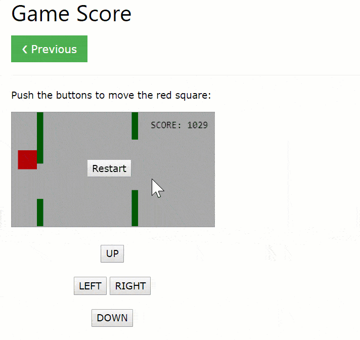
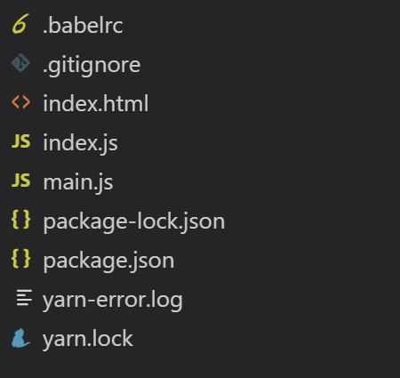

I've been looking into Tensorflow.js recently and have found the whole concept fascinating. Previously I wrote a piece on [how to get started](https://yashints.dev/blog/2018/11/27/get-started-with-tensorflowjs), and I intent to write more around all aspects of creating a new model, transfer learning with it, and just use pre-trained models for inference.

<!--more-->

## Let's review our plan 🗺️

Today we want to:

* Find a game written with JavaScript
* Find a model which we can control the game with
* Mix these two together and have 🤪
* Not complain about the code we just wrote to spoil the fun

## Disclaimer

I am not showing any best practices here around the JavaScript code. It is copy pasted from somewhere else and our purpose is to make it work.

## Finding the game

The very first thing I did when I was creating one of the demo's for [my talk]() was to search for a game written with JavaScript. I didn't want a complex game, just something which is lightweight and can be customised easily.

After searching for `JavaScript game` in Google, I found [this game on W3schools](https://www.w3schools.com/graphics/game_score.asp):



The game is very simple. You just need to guide the red cube between incoming green bars. If it touches any of the green bars, the game is over.

## Finding the right model

For this game, what I could think of really quick was [SpeechCommand](https://github.com/tensorflow/tfjs-models/tree/master/speech-commands). This model recognises the spoken commands comprised of simple words. For now it only has 18 words, but we wouldn't even need that since all we need is directions (`up`, `down`, `left`, and `right`).

This model is using the [WebAudio API](https://developer.mozilla.org/en-US/docs/Web/API/Web_Audio_API) to listen to your voice through your microphone.

## Let's code 💻

First thing first, we need to get the code behind our game. Thankfully, it's on the same [page we found the game](https://www.w3schools.com/graphics/tryit.asp?filename=trygame_score).

```html
<html>
<head>
<meta name="viewport" content="width=device-width, initial-scale=1.0"/>
<style>
canvas {
    border:1px solid #d3d3d3;
    background-color: #f1f1f1;
}
</style>
</head>
<body onload="startGame()">
<script>

var myGamePiece;
var myObstacles = [];
var myScore;

function startGame() {
    myGamePiece = new component(30, 30, "red", 10, 120);
    myScore = new component("30px", "Consolas", "black", 280, 40, "text");
    myGameArea.start();
}

var myGameArea = {
    canvas : document.createElement("canvas"),
    start : function() {
        this.canvas.width = 480;
        this.canvas.height = 270;
        this.context = this.canvas.getContext("2d");
        document.body.insertBefore(this.canvas, document.body.childNodes[0]);
        this.frameNo = 0;
        this.interval = setInterval(updateGameArea, 20);
        },
    clear : function() {
        this.context.clearRect(0, 0, this.canvas.width, this.canvas.height);
    },
    stop : function() {
        clearInterval(this.interval);
    }
}

function component(width, height, color, x, y, type) {
    this.type = type;
    this.width = width;
    this.height = height;
    this.speedX = 0;
    this.speedY = 0;    
    this.x = x;
    this.y = y;    
    this.update = function() {
        ctx = myGameArea.context;
        if (this.type == "text") {
            ctx.font = this.width + " " + this.height;
            ctx.fillStyle = color;
            ctx.fillText(this.text, this.x, this.y);
        } else {
            ctx.fillStyle = color;
            ctx.fillRect(this.x, this.y, this.width, this.height);
        }
    }
    this.newPos = function() {
        this.x += this.speedX;
        this.y += this.speedY;        
    }
    this.crashWith = function(otherobj) {
        var myleft = this.x;
        var myright = this.x + (this.width);
        var mytop = this.y;
        var mybottom = this.y + (this.height);
        var otherleft = otherobj.x;
        var otherright = otherobj.x + (otherobj.width);
        var othertop = otherobj.y;
        var otherbottom = otherobj.y + (otherobj.height);
        var crash = true;
        if ((mybottom < othertop) || (mytop > otherbottom) || (myright < otherleft) || (myleft > otherright)) {
            crash = false;
        }
        return crash;
    }
}

function updateGameArea() {
    var x, height, gap, minHeight, maxHeight, minGap, maxGap;
    for (i = 0; i < myObstacles.length; i += 1) {
        if (myGamePiece.crashWith(myObstacles[i])) {
            myGameArea.stop();
            return;
        } 
    }
    myGameArea.clear();
    myGameArea.frameNo += 1;
    if (myGameArea.frameNo == 1 || everyinterval(150)) {
        x = myGameArea.canvas.width;
        minHeight = 20;
        maxHeight = 200;
        height = Math.floor(Math.random()*(maxHeight-minHeight+1)+minHeight);
        minGap = 50;
        maxGap = 200;
        gap = Math.floor(Math.random()*(maxGap-minGap+1)+minGap);
        myObstacles.push(new component(10, height, "green", x, 0));
        myObstacles.push(new component(10, x - height - gap, "green", x, height + gap));
    }
    for (i = 0; i < myObstacles.length; i += 1) {
        myObstacles[i].speedX = -1;
        myObstacles[i].newPos();
        myObstacles[i].update();
    }
    myScore.text="SCORE: " + myGameArea.frameNo;
    myScore.update();
    myGamePiece.newPos();    
    myGamePiece.update();
}

function everyinterval(n) {
    if ((myGameArea.frameNo / n) % 1 == 0) {return true;}
    return false;
}

function moveup() {
    myGamePiece.speedY = -1; 
}

function movedown() {
    myGamePiece.speedY = 1; 
}

function moveleft() {
    myGamePiece.speedX = -1; 
}

function moveright() {
    myGamePiece.speedX = 1; 
}

function clearmove() {
    myGamePiece.speedX = 0; 
    myGamePiece.speedY = 0; 
}
</script>
<div style="text-align:center;width:480px;">
  <button onmousedown="moveup()" onmouseup="clearmove()" ontouchstart="moveup()">UP</button><br><br>
  <button onmousedown="moveleft()" onmouseup="clearmove()" ontouchstart="moveleft()">LEFT</button>
  <button onmousedown="moveright()" onmouseup="clearmove()" ontouchstart="moveright()">RIGHT</button><br><br>
  <button onmousedown="movedown()" onmouseup="clearmove()" ontouchstart="movedown()">DOWN</button>
</div>

<p>The score will count one point for each frame you manage to "stay alive".</p>
</body>
</html>
```
### Creating the project structure

Let's setup our project structure at this point. We will need the following files:

* `package.json`
* `index.html`
* `game.js`
* `index.js`

In our `package.json` we will need some dependencies and a script command to run the app.

```json
{
...
  "dependencies": {
    "@tensorflow-models/speech-commands": "^0.3.9",
    "@tensorflow/tfjs": "^1.2.8"
  },
  "scripts": {
    "watch": "cross-env NODE_OPTIONS=--max_old_space_size=4096 NODE_ENV=development parcel index.html --no-hmr --open"
  },
  "devDependencies": {
    "@babel/core": "^7.0.0-0",
    "@babel/plugin-transform-runtime": "^7.1.0",
    "babel-core": "^6.26.3",
    "babel-polyfill": "~6.26.0",
    "babel-preset-env": "~1.6.1",
    "babel-preset-es2017": "^6.24.1",
    "clang-format": "~1.2.2",
    "cross-env": "^5.2.0",
    "eslint": "^4.19.1",
    "eslint-config-google": "^0.9.1",
    "parcel-bundler": "~1.10.3"
  },
...
}
```

I am using parcel here since it's easy to setup and it just works. Besides, most of the demo's on [Tensorflow.js models GitHub repository](https://github.com/tensorflow/tfjs-models) are using parcel.

Your project structure should look like:



### Converting the game code into a module

For now, let's not focus on the code that much since we need to do some refactoring. First thing first, let's separate our JavaScript code into a separate file. With doing so your HTML should look like:

```html
<!DOCTYPE html>

<html class="no-js">
  <head>
    <meta charset="utf-8" />
    <meta http-equiv="X-UA-Compatible" content="IE=edge" />
    <title>TensorFlow.js Speech Commands Model Demo</title>
    <meta name="description" content="" />
    <meta name="viewport" content="width=device-width, initial-scale=1" />
    <style>
      canvas {
        border: 1px solid #d3d3d3;
        background-color: #f1f1f1;
      }
    </style>
    
  </head>
  <body>
    <script src="index.js"></script>
  </body>
</html>
```

Since we are going to use **SpeechCommand** module, we need to change our JavaScript code to support that. Create a file called `main.js` and paste the below code in it.

```js
var myGamePiece;
var myObstacles = [];
var myScore;

export const startGame = function() {
    myGamePiece = new component(30, 30, "red", 10, 120);
    myScore = new component("30px", "Consolas", "black", 280, 40, "text");
    myGameArea.start();
}

var myGameArea = {
    canvas : document.createElement("canvas"),
    start : function() {
        this.canvas.width = 480;
        this.canvas.height = 270;
        this.context = this.canvas.getContext("2d");
        document.body.insertBefore(this.canvas, document.body.childNodes[0]);
        this.frameNo = 0;
        this.interval = setInterval(updateGameArea, 40);
        },
    clear : function() {
        this.context.clearRect(0, 0, this.canvas.width, this.canvas.height);
    },
    stop : function() {
        clearInterval(this.interval);
    }
}

function component(width, height, color, x, y, type) {
    this.type = type;
    this.width = width;
    this.height = height;
    this.speedX = 0;
    this.speedY = 0;    
    this.x = x;
    this.y = y;    
    this.update = function() {
        let ctx = myGameArea.context;
        if (this.type == "text") {
            ctx.font = this.width + " " + this.height;
            ctx.fillStyle = color;
            ctx.fillText(this.text, this.x, this.y);
        } else {
            ctx.fillStyle = color;
            ctx.fillRect(this.x, this.y, this.width, this.height);
        }
    }
    this.newPos = function() {
        this.x += this.speedX;
        this.y += this.speedY;        
    }
    this.crashWith = function(otherobj) {
        let myleft = this.x;
        let myright = this.x + (this.width);
        let mytop = this.y;
        let mybottom = this.y + (this.height);
        let otherleft = otherobj.x;
        let otherright = otherobj.x + (otherobj.width);
        let othertop = otherobj.y;
        let otherbottom = otherobj.y + (otherobj.height);
        let crash = true;
        if ((mybottom < othertop) || (mytop > otherbottom) || (myright < otherleft) || (myleft > otherright)) {
            crash = false;
        }
        return crash;
    }
}

function updateGameArea() {
    let x, height, gap, minHeight, maxHeight, minGap, maxGap;
    for (let i = 0; i < myObstacles.length; i += 1) {
        if (myGamePiece.crashWith(myObstacles[i])) {
            myGameArea.stop();
            return;
        } 
    }
    myGameArea.clear();
    myGameArea.frameNo += 1;
    if (myGameArea.frameNo == 1 || everyinterval(180)) {
        x = myGameArea.canvas.width;
        minHeight = 20;
        maxHeight = 200;
        height = Math.floor(Math.random()*(maxHeight-minHeight+1)+minHeight);
        minGap = 50;
        maxGap = 200;
        gap = Math.floor(Math.random()*(maxGap-minGap+1)+minGap);
        myObstacles.push(new component(10, height, "green", x, 0));
        myObstacles.push(new component(10, x - height - gap, "green", x, height + gap));
    }
    for (let j = 0; j < myObstacles.length; j += 1) {
        myObstacles[j].speedX = -1;
        myObstacles[j].newPos();
        myObstacles[j].update();
    }
    myScore.text="SCORE: " + myGameArea.frameNo;
    myScore.update();
    myGamePiece.newPos();    
    myGamePiece.update();
}

export const everyinterval = function(n) {
    if ((myGameArea.frameNo / n) % 1 == 0) {return true;}
    return false;
}

export const moveup = function() {
    myGamePiece.speedY = -1; 
}

export const movedown = function() {
    myGamePiece.speedY = 1; 
}

export const moveleft = function() {
    myGamePiece.speedX = -1; 
}

export const moveright = function() {
    myGamePiece.speedX = 1; 
}

export const clearmove = function() {
    myGamePiece.speedX = 0; 
    myGamePiece.speedY = 0; 
}
```

All I did here is change some of those functions to `const` and export what need later on. Now let's write our `index.js` and import the speech command model.

```js
import * as speechCommands from "@tensorflow-models/speech-commands";
```

Next, import the functions we will need to play the game:

```js
import { startGame, moveup, movedown, clearmove } from './main';
```

I am not going to use left and write, but you could totally use them too. Next up, we need to create an instance of the model and initialise it. Since loading the model requires an async call, we will use an [IIFE (Immediately-Invoked Function Expression)](https://en.wikipedia.org/wiki/Immediately-invoked_function_expression):

```js
const recognizer = speechCommands.create("BROWSER_FFT");

(async function() {
  await recognizer.ensureModelLoaded();

  console.log(recognizer.wordLabels());

  startGame();
})();
```

We call start game once the model is loaded. At last, we need to call the `listen` method on our instance to be able to listen to commands:

```js
const suppressionTimeMillis = 1000;
const allowedCommands = ['up', 'down'];

recognizer
  .listen(
    result => {
      checkPredictions(recognizer.wordLabels(), result.scores,
      2, suppressionTimeMillis);
    },
    {
      includeSpectrogram: true,
      suppressionTimeMillis,
      probabilityThreshold: 0.8
    }
  )
  .then(() => {
    console.log("Streaming recognition started.");
  })
  .catch(err => {
    console.log("ERROR: Failed to start streaming display: " + err.message);
  });

const checkPredictions = (
  candidateWords,
  probabilities,
  topK,
  timeToLiveMillis
) => {
  if (topK != null) {
    let wordsAndProbs = [];
    for (let i = 0; i < candidateWords.length; ++i) {
      wordsAndProbs.push([candidateWords[i], probabilities[i]]);
    }
    wordsAndProbs.sort((a, b) => b[1] - a[1]);
    wordsAndProbs = wordsAndProbs.slice(0, topK);
    candidateWords = wordsAndProbs.map(item => item[0]);
    probabilities = wordsAndProbs.map(item => item[1]);
    console.log(wordsAndProbs);
    // Highlight the top word.
    const topWord = wordsAndProbs[0][0];
    if(allowedCommands.includes(topWord)) {
      if(topWord === 'up') {
        moveup();
        setTimeout(() => clearmove(), 850);
        console.log('up');
      } else {
        movedown();
        setTimeout(() => clearmove(), 850);
        console.log('down');
      }
    }
    
  }
}
```

This will start our game and also listens to your mic. You will need to give permission to your browser to use your mic if you haven't done already.

Listen method returns a promise which will have a result object. When we get the result, we will call our little helper function to check which words are recognised an fire an action based on that.

[Check the live demo here](https://jsgame-speechcommand.netlify.com/).

## Improvement

If you've had a look at the documentation on [SpeechCommand repo](https://github.com/tensorflow/tfjs-models/tree/master/speech-commands), you can see when calling `speechCommands.create()`, you can specify the vocabulary the loaded model will be able to recognize. This is specified as the second, optional argument to `speechCommands.create()`. We can use that to limit the words to only directional:

```js
const recognizer = speechCommands.create('BROWSER_FFT', 'directional4w');
```

Now if you try the model, it will be more accurate because it only focuses on directional words (`up`, `down`, `left`, and `right`).

## Summary

That's it. This is all you need to do in order to control this mini game using your voice with `Tensorflow.js` **SpeechCommand** model.

Now go and create something fun with those pre-trained models and make sure to check their example repository.

For more inspiring demo's check [aijs.rocks](https://aijs.rocks/) which is was built by [Asim Hussain](https://twitter.com/jawache), [Eleanor Haproff](https://twitter.com/EleanorHaproff) and [Osama Jandali](https://twitter.com/osama_jandali).