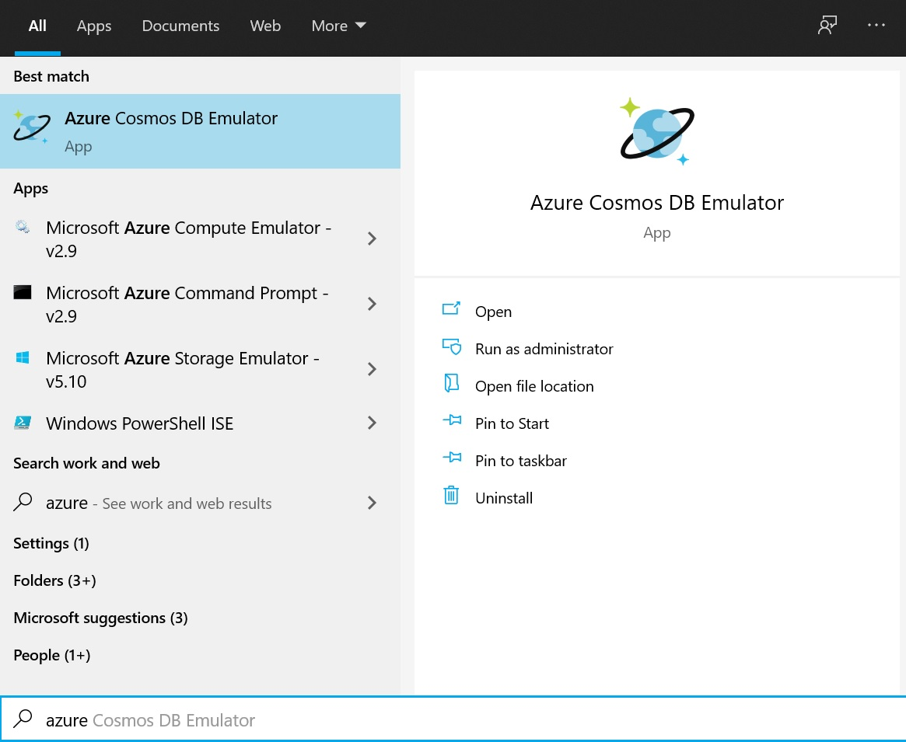

[Azure Cosmos DB](https://azure.microsoft.com/en-au/services/cosmos-db/) is one of the foundational services in Azure, which provides high availability, global scale and an impressive performance. However, it could be a bit costly for developers to spin up an instance during their development especially if they don't know some of the basics such as what should be the partition key, what throughput they should select and so on that much. 

[The Azure Cosmos DB Emulator](https://docs.microsoft.com/en-us/azure/cosmos-db/local-emulator) is a service provided by Microsoft which allows you to emulate the Cosmos DB Service locally for development purposes. In addition, no matter whether you're using Azure CosmosDB or not, at some point you might have to test some sort of DocumentDB locally. 

<!--more-->

## Intro

Let's be honest, there are other ways to work with Cosmos DB without paying any money such as a [Free Trial Account](https://azure.microsoft.com/en-us/free/) which gives you **$200 dollars** to spend over a year, or even the [Cosmos DB Query Playground](https://www.documentdb.com/sql/demo) which is an interactive website which helps you to learn the query syntax and provides you with a set of pre-defined JSON documents to work with.

But eventually you either run out of money, or your product is live and your developers want to develop new features and fix bugs to be released very quickly. That's when _Cosmos DB Emulator_ really comes to the rescue. You have other advantages such as ability to work offline and or even have an Azure subscription.

## Features

### API set

Azure Cosmos DB supports SQL API, as well as Table, MongoDB, Cassandra, and Gremlin which to me covers many scenarios from migrating an existing database from on-premise to Azure, modernising your legacy application, or create a brand new one. Azure Cosmos DB Emulator also supports these APIs although the underlying implementation details are different to the real service on Azure. In fact the emulator hides all abstractions from you and lets you focus on adding value to your team or organisation.

> 💡 However keep in mind that the data explorer provided with the service **only** supports **SQL API** at the moment.

### Number of containers

The emulator allows you to create a single account with multiple (up to 25 fixed sized, or 5 unlimited) containers.

### Operating System

At the moment, the emulator only supports 64-bit versions of Windows (Server 2012 R2, Server 2016, Server 2019, Windows 10) which demands a minimum of 2GB of RAM and 10GB of free disk space. You must also have administrative privileges to be able to install the client.

In addition to that, it also comes with docker image which you can use to run the emulator in a docker container but only on windows containers. If you want to use docker in Linux or macOS, you will need to use it on a Windows virtual machine.

## Installation

Simply [download the executable from here](https://aka.ms/cosmosdb-emulator) and install it on your Windows OS, if you're running Linux or macOS or want to run it in a docker container please refer to [the official documentation](https://docs.microsoft.com/en-us/azure/cosmos-db/local-emulator?tabs=cli%2Cssl-netstd21#run-on-windows-docker).

## Differences

As amazing it looks, there are a few differences you need to keep in mind when working with the emulator:

* As I mentioned before the data explorer only supports the SQL API. But you can use all other APIs from within your application using the SDK.
* It only supports a single account with a well known key. You can change the key from command line, but you cannot change it in the explorer.
* For now it only supports provisioning throughput mode only, meaning you can't use it in serverless mode.
* It does not support core features such as different consistency levels, scaling, replication and performance guaranties.
* Since the client might not be up to date with Azure Cosmos DB service, make sure you always check the [Azure Cosmos DB capacity planner](https://docs.microsoft.com/en-us/azure/cosmos-db/estimate-ru-with-capacity-planner) to accurately estimate your required throughput.
* And the minimum ID property size is 256 characters.

## Summary

In this short article I just showed you the tip of the iceberg about what the Azure Cosmos DB Emulator has to offer for you. It's a great utility to be able to develop applications who rely on Azure Cosmos DB locally and has helped me in my pet projects which doesn't even need to work with a Cosmos DB instance. Keep an eye out for more articles on some use cases this amazing tool can help you with.

